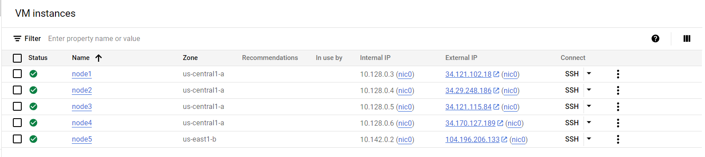
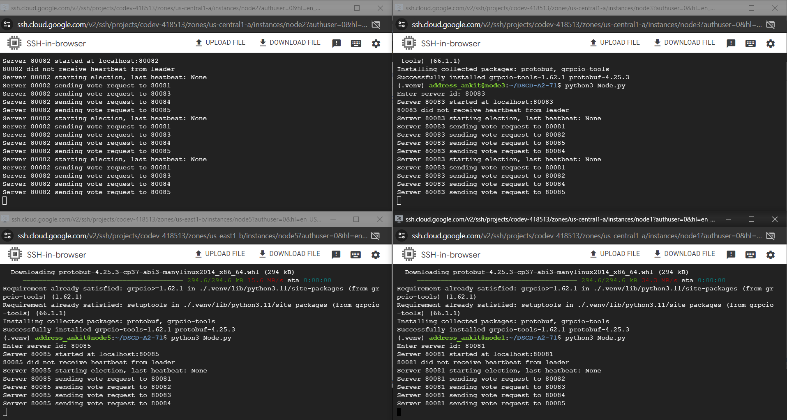
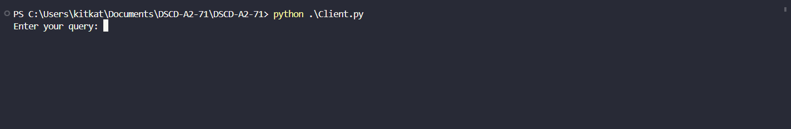

Assignement 2 DSCD
Ankit Kumar
Aryan Rohilla
Dharani Kumar S

### Google cloud setup
- Created 5 VMs, 4 in one region(upper limit is 4) and 1 in another region.


- Since IP addresses can change, I have to manually change the input IP addresses in the code.

- here is the setup where nodes are running on my google cloud


client running on the local machine vscode


# Modified Raft.py with Leader Lease using gRPC

Proto file can be found in the raft.proto

## Installation
- setup the environment
- install grpcio-tools and grpcio
- run the following command to generate the python files from the proto file
```bash
python3 -m grpc_tools.protoc -I. --python_out=. --grpc_python_out=. raft.proto
```
## Usage
- To start a Raft node:
```bash
python3 Node.py
```

- set up the server id in the code that is port and IP address

- Run the above command in 5 different terminals, and enter the following server id in each terminal:

- To start a Raft client:
```bash
python3 Client.py
```

- The client can send the following commands

- `SET key value` to set a key-value pair
- `GET key` to get the value of a key


